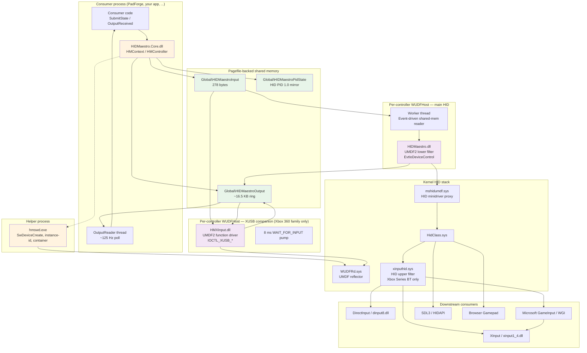

# Architecture Overview

The 30,000-foot view of HIDMaestro: every component, what it owns, and how data flows from a consumer's `SubmitState` call to a game seeing input. Use this page as the starting point for the architecture chapter; the deep-dive subpages cover one component each.



---

## The five components

### 1. `HIDMaestro.Core.dll`: the SDK

Lives in the consumer process. Exposes `HMContext`, `HMController`, `HMProfile`, etc. (see [SDK Reference](../sdk/sdk-reference.md)).

Responsibilities:

- Embed and extract the driver payload (driver DLLs, INFs, signing toolchain, `hmswd.exe`) on first install.
- Generate a self-signed certificate, sign the binaries, run `pnputil /add-driver`.
- Allocate per-controller indices and orchestrate `SetupController` (registry write &rarr; `SwDeviceCreate` or `SetupDiCreateDeviceInfoW` &rarr; PnP wait &rarr; XInput slot-claim wait).
- Provide the abstract `HMGamepadState` &rarr; HID descriptor encoding.
- Run the per-controller output-reader background thread that drains the shared output ring at ~125 Hz.
- Manage HID PID 1.0 force-feedback shared state.
- Manage `joy.cpl` OEM-name overrides with crash-safe restore.
- Embed and load the 231-profile catalog.

Lines of code: ~4,500 in public surface (`HMContext` / `HMController` / `HidDescriptorBuilder` / `HMProfileBuilder` / `HMDeviceExtractor` / `HMOemNameOverride` / value types) plus ~9,000 in `Internal/` (`DeviceOrchestrator`, `DeviceManager`, `SwdDeviceFactory`, `DriverBuilder`, `HidDescriptorReconstructor`, `HidReportBuilder`, `SharedMemoryIO`, `OemNameOverrideStore`, `PnputilHelper`, etc.).

### 2. `HIDMaestro.dll`: the UMDF2 driver

Lives in a per-controller `WUDFHost.exe` instance. Compiled from `driver/driver.c` (1,574 lines). Acts as a UMDF2 lower filter under `mshidumdf.sys` &mdash; the standard pattern from Microsoft's [`vhidmini2` sample](https://github.com/microsoft/Windows-driver-samples/tree/main/hid/vhidmini2). The HID class stack sees a real HID device; HIDMaestro is the user-mode component that:

- Synthesizes the descriptor from the per-controller registry key written by the SDK at create time.
- Owns a worker thread (`WorkerThread`) that opens the per-controller shared input section and signals on `Global\HIDMaestroInputEvent<N>` to wake on each new frame.
- Handles `IOCTL_HID_READ_REPORT` synchronously when there's new data (seqno gate); otherwise pends in `ManualQueue` and completes from the worker thread.
- Handles `IOCTL_UMDF_HID_GET_FEATURE` / `_SET_FEATURE` / `_SET_OUTPUT_REPORT` for HID PID 1.0 and for vendor output reports. Output IOCTLs publish into the shared output ring with `OutputLock` serialization.
- Handles HID string queries (`HID_STRING_ID_IPRODUCT` / `IMANUFACTURER` / `ISERIALNUMBER`) from per-instance fields.

INF: `hidmaestro.inf`. Class GUID: `{745a17a0-74d3-11d0-b6fe-00a0c90f57da}` (HIDClass). `LowerFilters = WUDFRd`. `UmdfHostProcessSharing = ProcessSharingDisabled` so each instance gets its own host process.

Detail: [UMDF2 Driver Internals](umdf2-driver-internals.md).

### 3. `HMXInput.dll`: the XUSB companion

Lives in a separate per-controller `WUDFHost.exe`. Compiled from `driver/companion.c` (745 lines). Acts as a UMDF2 function driver under the System setup class. Created **only for non-xinputhid Xbox profiles** (Xbox 360 Wired family). Responsibilities:

- Register the XUSB device interface (`{EC87F1E3-...}`) for `xinput1_4.dll` discovery.
- Run an 8 ms `WAIT_FOR_INPUT` pump that drains pended `IOCTL_XUSB_WAIT_FOR_INPUT` requests with 29-byte XUSB-state replies. Required for WGI's async input pump (`XusbDevice::QueueInputBuffer`).
- Translate the 14-byte GIP-format buffer the SDK packs in shared memory into XINPUT_GAMEPAD wire format on `IOCTL_XUSB_GET_STATE`.
- Capture `IOCTL_XUSB_SET_STATE` 5-byte vibration packets and publish them into the output ring as `HMOutputSource.XInput`.
- Carry a registry-string `UpperFilters = "xinputhid"` &mdash; **not** to load the kernel filter (System class isn't a filter target), but to pass WGI's `IsDeviceOrAncestorFilteredBy` `wcsncmp` check that admits the device to WGI's XUSB dispatch path.

INF: `hidmaestro_xusb.inf`. Class GUID: `{4D36E97D-...}` (System). Created via `SwDeviceCreate` with explicit per-controller ContainerID (shared with the main HID device).

Detail: [XUSB Companion](xusb-companion.md).

### 4. `hmswd.exe`: the SwDevice helper

Standalone native executable (~286 lines C). Created **only because** `.NET 10`'s P/Invoke to `cfgmgr32!SwDeviceCreate` returns `0x8007007E ERROR_MOD_NOT_FOUND` on Win11 26200, while the identical C call succeeds. Neither `CoInitializeEx`, preloaded DLLs, `UnmanagedCallersOnly` function pointers, nor explicit function-ptr marshaling fix it. Rather than ship a broken managed migration path, the SDK invokes this small helper via `Process.Start`.

Args: `create | remove <enumerator> <suffix> <container-guid> <hw-ids> <compat-ids> <description>`. Returns the resulting instance ID on stdout for the SDK to record.

Lifetime: `SWDeviceLifetimeParentPresent` so the device persists past process exit. `remove` reconnects to the previously-created device by re-`SwDeviceCreate`-ing with identical args (the docs guarantee this returns a fresh handle to the existing device), downgrades lifetime to `Handle`, then `SwDeviceClose`.

Detail: [SwDevice and PnP](swdevice-and-pnp.md).

### 5. The 231-profile catalog

Embedded as a JSON resource inside `HIDMaestro.Core.dll`. 32 vendor folders, ~4-25 profiles each. See [Profile System](../profiles/profile-system.md) for the schema and runtime classification.

---

## Process / privilege model

| Process | Privilege | Purpose |
|---------|-----------|---------|
| Consumer process | Admin (or non-admin for read-only operations) | Hosts `HIDMaestro.Core.dll`. Drives `SubmitState` from any thread. |
| `WUDFHost.exe` (main HID, per-controller) | LocalService | Hosts `HIDMaestro.dll`. Spawned by `WUDFRd.sys` per device instance. |
| `WUDFHost.exe` (XUSB companion, per-controller) | LocalService | Hosts `HMXInput.dll`. Only spawned for non-xinputhid Xbox profiles. |
| `hmswd.exe` (helper, transient) | Inherits caller's privilege (admin) | Calls `SwDeviceCreate`, returns instance ID, exits. Lifetime <1 s per invocation. |

`UmdfHostProcessSharing = ProcessSharingDisabled` in both INFs ensures per-controller hosts. With 6 controllers running you'll see 6-12 `WUDFHost.exe` instances depending on which profiles are active. ~8 MB RSS, ~10 threads each.

This was a deliberate fix. Default (`ProcessSharingEnabled`, the WDF directive defined in INF `[...NT.Wdf]` sections) funnels every instance into one shared `WUDFHost`; at 6 controllers that host accumulates 9+ minutes of CPU time vs ~2 seconds per per-instance host. The contention is between writer threads and concurrent `XInputGetState` reader threads when 2+ virtuals coexist with a real xinputhid device in the same host. See [`docs/investigations/issue3-dual-xinputhid-saturation-2026-04/`](https://github.com/hifihedgehog/HIDMaestro/tree/master/docs/investigations/issue3-dual-xinputhid-saturation-2026-04) for the full investigation.

---

## Data flow: input

A consumer's `HMController.SubmitState(state)` call arrives at every downstream API in this order:

```
Consumer thread
  ↓ HMController.SubmitState(state)
SDK encodes state → HID native bytes via HidReportBuilder
  ↓
Writes Data[] + GipData[] + SeqNo to Global\HIDMaestroInput<N>
  ↓ SetEvent on Global\HIDMaestroInputEvent<N>
─────── shared memory boundary ────────
Driver worker thread wakes (WaitForMultipleObjects on Stop+Input events)
  ↓ ProcessSharedInput
Reads SeqNo, Data[], DataSize
  ↓ WdfRequestComplete on pended IOCTL_HID_READ_REPORT (if pending)
HidClass.sys delivers to:
  ├─ DirectInput consumers (dinput8.dll)
  ├─ HIDAPI consumers (Chromium RawInput, SDL3 HIDAPI fallback)
  └─ WGI (Windows.Gaming.Input.dll)
        └─ Browser Gamepad

For Xbox-VID profiles, in parallel:
GIP buffer is read by the XUSB companion on IOCTL_XUSB_GET_STATE
  ↓ companion translates 14-byte GIP → XINPUT_GAMEPAD wire format
XInput consumers (xinput1_4.dll → XInputGetState)
  └─ via XUSB device interface {EC87F1E3-...}
WGI also reads from the XUSB path (admitted via xinputhid UpperFilter tripwire)
```

End-to-end latency from `SubmitState` to a DirectInput `GetDeviceState` poll seeing the new bytes: typically <2 ms. The shared-memory write is ~250 ns, the event signal is ~5 µs, the worker wake is ~50 µs, the IOCTL completion is ~100 µs, the consumer's poll cycle is whatever rate they run at.

---

## Data flow: output

```
Game / DInput PID FFB / Browser put_Vibration / XInputSetState
  ↓ IOCTL_UMDF_HID_SET_OUTPUT_REPORT (or IOCTL_XUSB_SET_STATE on XUSB companion)
Driver / companion captures bytes
  ↓ takes OutputLock
  ↓ increments Head, writes Slots[(Head-1) % 64]
─────── shared memory boundary ────────
SDK output reader thread on next poll (~8 ms cadence)
  ↓ TryReadOutputFrame: Head moved, drain new slots in seqlock-safe order
Raises HMController.OutputReceived(packet) on poll thread
  ↓ Consumer handler decodes per (Source, ReportId)
```

Multiple `OutputReceived` invocations per poll iteration are normal &mdash; PID FFB writes Set Effect &rarr; Set Constant Force &rarr; Effect Operation Start within 1-3 ms and all three drain on the next poll.

---

## The three architecture groups (recap)

| Group | Profiles | Device tree | Notes |
|-------|----------|-------------|-------|
| **Plain HID** | DualSense, Logitech wheels, Thrustmaster HOTAS, ~204 profiles | `ROOT\VID_*&PID_*\NNNN` | Lightest stack. No companion. |
| **Non-xinputhid Xbox** | Xbox 360 Wired family (~6) | `ROOT\VID_045E&PID_*&IG_00\NNNN` + `SWD\HIDMAESTRO\<sid>_NNNN` | Two device trees. XUSB companion. |
| **xinputhid Xbox** | Xbox Series BT, Xbox One BT, Xbox Elite v2 BT (~4) | `SWD\HIDMAESTRO_VID_045E_PID_*&IG_00\<sid>_NNNN` | xinputhid kernel filter binds upstream. SwD-enumerated parent. |

See [Profile System](../profiles/profile-system.md) for the runtime classification and [Lifecycle and Teardown](lifecycle-and-teardown.md) for per-group create/dispose latencies.

---

## File / source layout

```
HIDMaestro/
├── driver/                        ; native UMDF2 sources
│   ├── driver.c                   ; main HID driver (1,574 lines)
│   ├── driver.h                   ; device context, IOCTL constants, shared-section types
│   ├── companion.c                ; XUSB companion (745 lines)
│   ├── hidmaestro.inf             ; main HID INF
│   ├── hidmaestro_xusb.inf        ; XUSB companion INF
│   └── hmswd/hmswd.c              ; SwDevice helper (286 lines)
│
├── sdk/HIDMaestro.Core/           ; the C# SDK
│   ├── HMContext.cs               ; entry point, profile catalog, controller alloc
│   ├── HMController.cs            ; live virtual, SubmitState, OutputReceived, PID FFB
│   ├── HMProfile.cs               ; immutable profile handle
│   ├── HMProfileBuilder.cs        ; fluent profile builder
│   ├── HMGamepadState.cs          ; abstract input frame
│   ├── HidDescriptorBuilder.cs    ; fluent HID descriptor builder
│   ├── HMDeviceExtractor.cs       ; extract from physical HID
│   ├── HMOemNameOverride.cs       ; joy.cpl label override
│   ├── HMOutputPacket.cs          ; output packet types
│   ├── HMPidState.cs              ; PID FFB enums + structs
│   ├── HMHidDeviceInfo.cs         ; HID device info from extractor
│   ├── Internal/
│   │   ├── DeviceOrchestrator.cs  ; SetupController / TeardownController (2,363 lines)
│   │   ├── DeviceManager.cs       ; PnP device tree management (1,024 lines)
│   │   ├── SwdDeviceFactory.cs    ; hmswd.exe wrapping (397 lines)
│   │   ├── DriverBuilder.cs       ; embedded payload extract + sign (509 lines)
│   │   ├── HidReportBuilder.cs    ; HID descriptor parse + report encode (600 lines)
│   │   ├── HidDescriptorReconstructor.cs  ; preparsed → descriptor (1,002 lines)
│   │   ├── SharedMemoryIO.cs      ; shared section wire format (669 lines)
│   │   ├── OemNameOverrideStore.cs ; crash-safe OEM name registry writes (325 lines)
│   │   ├── PnputilHelper.cs       ; pnputil + devcon shell-out helpers (275 lines)
│   │   ├── ControllerProfile.cs   ; internal profile model (321 lines)
│   │   ├── HidDeviceEnumerator.cs ; SetupDi enumerate connected HIDs (233 lines)
│   │   ├── HidPreparsedData.cs    ; HidD_GetPreparsedData wrapper (150 lines)
│   │   ├── DeviceProperties.cs    ; DEVPKEY_* read/write (292 lines)
│   │   ├── DeviceNodeCreator.cs   ; SetupDiCreateDeviceInfoW path (335 lines)
│   │   ├── EmbeddedManifest.cs    ; SHA-256 of embedded payload
│   │   └── TimeoutScale.cs        ; HIDMAESTRO_TIMEOUT_SCALE env var
│   └── Resources/                 ; embedded driver payload
│       ├── HIDMaestro.dll          ; main driver
│       ├── HMXInput.dll            ; companion driver
│       ├── hmswd.exe               ; SwDevice helper
│       ├── hidmaestro.inf          ; main INF (stamped at build time)
│       ├── hidmaestro_xusb.inf     ; companion INF (stamped at build time)
│       ├── signtool.exe            ; signing
│       ├── Inf2Cat.exe             ; catalog generation
│       └── Microsoft.UniversalStore.HardwareWorkflow.*.dll  ; Inf2Cat dependencies
│
├── tools/HIDMaestroProfileExtractor/  ; standalone WPF extractor GUI
├── example/SdkDemo/                ; minimal SDK consumer
├── test/                           ; HIDMaestroTest CLI + regression battery + probes
├── profiles/                       ; 231 profile JSONs
├── scripts/                        ; build, signing, verification, multi-pad-check
├── build/                          ; build outputs (driver DLLs, hmswd.exe, stamped INFs)
└── docs/                           ; README screenshots, investigation notes
```

---

## What HIDMaestro is **not**

For symmetry with PadForge's wiki, here's what's deliberately out of scope:

- **A polling engine.** No internal pump thread for input. Consumers drive cadence.
- **A controller mapper.** No deadzones, sensitivity curves, button remapping at runtime &mdash; that's the consumer's job. PadForge handles the mapping; HIDMaestro just creates the virtuals.
- **A standalone app.** No UI, no settings, no config files of its own. The catalog is JSON in a DLL; the SDK is an API.
- **A kernel driver.** Everything is user-mode. UMDF2 + self-signed cert + TrustedPublisher. No EV cert, no `bcdedit /set testsigning`, no reboot.
- **A bus driver.** UMDF2 cannot publish PDOs. The XUSB companion is a peer device under the System class, not a child PDO of the main HID.
- **An anti-cheat bypass.** Virtual devices are detectable. HIDMaestro doesn't try to hide.
- **A force-feedback synthesizer.** The SDK delivers raw decoded packets. Effect mixing and condition synthesis are the consumer's job.

---

## Where to go next

| Direction | Read |
|-----------|------|
| **The driver code** | [UMDF2 Driver Internals](umdf2-driver-internals.md) |
| **The XUSB companion** | [XUSB Companion](xusb-companion.md) |
| **The PnP / SwDevice machinery** | [SwDevice and PnP](swdevice-and-pnp.md) |
| **The shared-memory wire format** | [Shared Memory Protocol](shared-memory-protocol.md) |
| **How each downstream API sees the device** | [Cross-API Coverage](cross-api-coverage.md) |
| **Multi-controller** | [Multi-Controller](multi-controller.md) |
| **Create / dispose** | [Lifecycle and Teardown](lifecycle-and-teardown.md) |
| **Driver install + signing** | [Driver Install and Signing](driver-install-and-signing.md) |
| **Build + release** | [Build and Release](build-and-release.md) |

## References

- Microsoft Learn topics on UMDF2 framework, HID Architecture, and the WUDFRd reflector. Search by topic name on [learn.microsoft.com](https://learn.microsoft.com/).
- [Microsoft `vhidmini2` sample](https://github.com/microsoft/Windows-driver-samples/tree/main/hid/vhidmini2) &mdash; the proven UMDF2 HID minidriver pattern.
- [DsHidMini](https://github.com/nefarius/DsHidMini) &mdash; Nefarius's UMDF2 + xinputhid project; the architectural ancestor.
- [References](references.md) &mdash; full source bibliography for every claim in this wiki.
